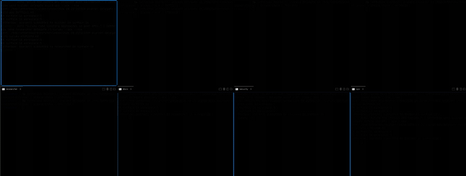

# Agent Letterbox for cmux

## Ring the bell. Create the team. Build the memories.




**Letterbox gives an agent team a durable place to build memory together.**

**Agent Letterbox for cmux turns separate coding-agent terminals into a live team — and every message between them into a durable record.**


## What it is

Agent Letterbox is not a model, a new terminal, or a second agent harness. It is the coordination layer that lets the agents you already run hand work to one another without making you the human message relay.

A task lands as a durable letter in a teammate's inbox. The doorbell rings, alerting the agent to check it:

```text
📬 letterbox doorbell: unacked <type> in <letterbox>/<agent>/inbox/ — please check
📬 letterbox doorbell: unacked <type> in <letterbox>/<agent>/inbox/ — please check · <8-lowercase-hex>
```

The agent wakes, picks up the real task from disk, replies, and keeps the work flowing. The terminal gets a ring; the inbox keeps the message.

> **Agent mail that waits safely—and a bell brings it alive.**

## The Agent Letterbox family

One product per terminal — the same letters, the same protocol, and the same core test suite, plus the tests each terminal needs. Pick the one matching the terminal you already run:

- **[cmux](https://github.com/SimonMallas/agent-letterbox-cmux)** — primary entry point
- [tmux](https://github.com/SimonMallas/agent-letterbox-tmux)
- [Herdr](https://github.com/SimonMallas/agent-letterbox-herdr)
- [Zellij](https://github.com/SimonMallas/agent-letterbox-zellij) — terminal ring requires `LETTERBOX_ZELLIJ_SUBMIT=1`

You are reading the **cmux** edition.

## Why it exists

Without coordination, a multi-agent workflow usually means juggling panes, copying task text, remembering who owns what, and hoping an offline agent eventually sees a message.

Directly injecting the full task into another terminal is fast, but the terminal becomes the only message record. Agent Letterbox keeps the fast part—the live doorbell—while putting the actual work in a durable, inspectable letter.

```text
full task    → durable inbox letter
live wake-up → short generic doorbell
reply        → sender inbox
archive      → recipient processed history
```

Read the full comparison in [Why Letterbox?](docs/why-letterbox.md).


## More memory than message

Letterbox is a thin shared memory layer for an agent team: durable
correspondence, handoffs, decisions, ACKs and RESULTs, and recoverable
history sitting on disk between separate context windows and a shared
brain. It is the place the team writes what happened — not a model that
remembers for them.

When one agent types into another's terminal, the message is spent the
moment it lands: the pane scrolls, the session compacts, and nothing
remains. Between agents there is no phone keeping a copy — an injected
handoff is the ONLY copy, and it dies with the scrollback.

A letter is different. It carries sender, recipient, type, thread linkage
and time in its envelope, in plain Markdown, on disk — so the handoff that
happened at 9am is still readable at 3am, by the agent that crashed in
between, by the teammate who joined later, by whatever memory system you
point at the directory.

What that buys, mechanically:

- **A crashed or compacted agent recovers its context from its own
  inbox** — restore is reading, not reconstruction.
- **"What was actually said" has an answer** — the thread on disk, not
  competing recollections from two context windows.
- **Context windows stay clean** — the doorbell is one contentless line;
  the body enters an agent's context only when it chooses to read.
- **Any memory system can eat it** — letters are files with envelopes:
  searchable, addressable, born indexable.

Letterbox is not a memory intelligence system. It does not summarize,
embed, rank, promote, or interpret. A separate memory layer may use
these records as ground truth. We keep the letter; the librarian can be
anyone's.

## How a task moves

v0.3 keeps accepted work visible until it reaches a final outcome.

```text
send task (requires_ack=true)
  → recipient: reply ack     # accepted WIP; letter stays in inbox (.md.ack)
  → recipient: does the work
  → recipient: reply result  # terminal; letter moves to processed/
```

Non-task letters (`info` / `status` / received replies) are filed with no invented response:

```bash
letterbox file <id>
```

See [SPEC.md](SPEC.md) and [docs/lifecycle.md](docs/lifecycle.md).

## What this opens up

- **Near-instant coordination** — a live agent can receive a doorbell and begin its next turn without human copy/paste.
- **Real handoffs** — implementation, review, research, QA, and fixes can move between agents as explicit owned work.
- **A visible team** — agents can live in separate cmux panels, workspaces, or windows and still coordinate across them.
- **Durable recovery** — if an agent is offline, restarting, busy, or misses the bell, the task remains in its inbox.
- **Clear responsibility** — task letters require ACK/NACK/RESULT; ACK means in progress, not done.
- **Evidence over claims** — inbox, reply, sidecar, and processed files show what happened even when an agent conversation is gone.
- **Less human relay work** — you direct the team instead of pasting the same request between terminals.

This repository is purpose-built for live cmux agent teams.

---

# Quick start: set up your cmux team

You need macOS or Linux, Bash, Git, and cmux. No server, database, cloud account, or custom cmux layout is required.

## Step 1 — Install Agent Letterbox

Open any terminal window. You can either copy/paste the commands yourself, **or simply give the prompt below to one of your existing coding agents**:

```text
Set up Agent Letterbox for cmux using the README Quick Start. Do not change my cmux layout.
```

### Or: add the skill straight to your agent

```bash
npx skills add SimonMallas/agent-letterbox-cmux
```

### Option A — Recommended: copy/paste installer

```bash
curl -fsSL https://raw.githubusercontent.com/SimonMallas/agent-letterbox-cmux/main/install.sh | sh
export PATH="$HOME/.local/bin:$PATH"
letterbox cmux setup --agents planner,reviewer,builder,researcher --automatic-doorbells
source "$HOME/.agent-letterbox/env.sh"
```

This downloads a local copy and sets up the team. If you are new to GitHub, you do not need to understand Git first—copying the block is enough.

To update later, run the same installer again:

```bash
curl -fsSL https://raw.githubusercontent.com/SimonMallas/agent-letterbox-cmux/main/install.sh | sh
```

### Option B — Manual Git install

Use this if you want to inspect the source, modify it, or contribute:

```bash
git clone https://github.com/SimonMallas/agent-letterbox-cmux.git \
  ~/src/agent-letterbox-cmux
cd ~/src/agent-letterbox-cmux
chmod +x bin/letterbox adapters/*.sh tests/*.sh
export PATH="$PWD/bin:$PATH"
letterbox cmux setup --agents planner,reviewer,builder,researcher --automatic-doorbells
source "$HOME/.agent-letterbox/env.sh"
```

Both options automatically create one shared Letterbox, agent inboxes, the global `letterbox` launcher, the shared Agent Letterbox skill, and the live-surface registration registry.

> `--automatic-doorbells` lets Letterbox type the generic doorbell into a live agent terminal. Use it only for dedicated agent terminals: like any terminal-input tool, it can submit text already typed in a target terminal.

## Step 2 — Open cmux your way

Open cmux and arrange agents however the task requires:

```text
one workspace per agent
four-panel grid
separate windows
any mix that suits the task
```

Agent Letterbox does not create, move, or resize your panels.

## Step 3 — Launch agents through Letterbox

In each agent's chosen cmux pane, use the launcher:

```bash
letterbox cmux run planner -- <your-agent-cli>
letterbox cmux run reviewer -- <your-agent-cli>
letterbox cmux run builder -- <your-agent-cli>
letterbox cmux run researcher -- <your-agent-cli>
```

The launcher gives the agent an identity, registers its current cmux surface, and starts it. That is what lets Letterbox find and ring agents across workspaces.

## Step 4 — Send the first handoff (ack, then result)

From the planner terminal:

```bash
printf '%s\n' 'Review src/auth.ts and report correctness findings.' |
  LETTERBOX_AGENT=planner letterbox send reviewer delegate auth-review --ack --now
```

Prefer `printf … | letterbox …` for bodies. Avoid unquoted heredocs when the text may contain `$` or backticks — the shell expands those before Letterbox sees them. The CLI owns frontmatter; only the body goes on stdin.

The reviewer receives a durable letter and a live cmux doorbell. v0.2 token-less knocks and v0.3 ` · <8hex>` knocks are both valid (prefix match; exact full-line equality is a cutover block). Accept the work (non-terminal):

```bash
printf '%s\n' 'ACK: reviewing auth.ts now.' |
  LETTERBOX_AGENT=reviewer letterbox reply <message-id-or-inbox-path> ack auth-review --now
```

The letter stays in the reviewer's inbox with an `.md.ack` sidecar (`letterbox check` shows `[ACCEPTED]`, display id, and optional progress — not the letter body). `letterbox read` prints the exact durable letter. When finished, close it:

```bash
printf '%s\n' 'RESULT: no critical issues; two nits in findings.md.' |
  LETTERBOX_AGENT=reviewer letterbox reply <message-id-or-inbox-path> result auth-review --now
```

Only `nack` or final `result` moves the original letter to `processed/`.

## New or duplicate agents

Give each new or duplicate session a unique identity:

```bash
letterbox cmux run planner-research -- <your-agent-cli>
letterbox cmux run builder-a -- <your-agent-cli>
letterbox cmux run agent-zero -- <your-agent-cli>
```

Each self-registers its exact current cmux surface, avoiding title collisions.

## Tested with

Each agent CLI below completed the full cycle live on this repo's current release — durable letter delivered, cmux doorbell rung in its pane, `ACK` returned, then `RESULT` — launched through `letterbox cmux run` (macOS, 2026-08-22):

| Agent CLI | Version tested | Teach file |
|---|---|---|
| Claude Code | 2.1.234 | `CLAUDE.md` |
| Gemini CLI | 0.46.0 | `GEMINI.md` |
| OpenAI Codex | 0.149.0 | `AGENTS.md` |
| OpenCode | 1.18.21 | `AGENTS.md` |
| Cursor Agent | 2026.08.11 | `AGENTS.md` |
| GitHub Copilot CLI | 1.0.80 | `AGENTS.md` |

The teach file is a short note in the working directory telling the agent what a doorbell means and how to reply — Gemini CLI found and activated the bundled Letterbox skill from the doorbell alone. Any agent that can run shell commands and read a file can join the same way. The maintainers' own team (Claude, Grok, Kimi, Pi, Hermes) runs this letter protocol daily.

Two things worth knowing:

- **First-run dialogs can eat the doorbell's Enter.** Trust-this-folder prompts, logins, and slow TUI start-up may swallow the submitted keypress, leaving the doorbell text sitting unsubmitted in the agent's input box. The letter itself is never lost — it is already durable in the inbox. Press Enter in that pane, or ring again once the agent is idle.
- **Launch with your box visible.** `letterbox` resolves the box from `LETTERBOX_DIR`, then `~/.config/agent-letterbox/default-dir`, then falls back to `$PWD/.letterbox`. If an agent seems to register "nowhere", it registered into the fallback box of its working directory — export `LETTERBOX_DIR` in the launching shell.

## Using a pre-release checkout

If you installed an earlier checkout from `main`, reinstall from the current branch and use the lifecycle commands above. v0.3 adds operational reading verbs and additive doorbell tokens while keeping v0.2 letters valid. v0.2 introduced an optional additive `thread` field; existing letters remain valid and older readers ignore it. All agents in one team should run the same helper version.

## Test the installation

```bash
letterbox --version
make test
```

## Learn more

**If you are an agent, start here:** [skills/agent-letterbox/SKILL.md](skills/agent-letterbox/SKILL.md) — the operating manual. It carries the doorbell acceptance rule you need to recognise a knock, the reply lifecycle, and the safety boundaries. The list below is background.

- [docs/lifecycle.md](docs/lifecycle.md) — task vs non-task, ACK/NACK/RESULT, `file`
- [docs/why-letterbox.md](docs/why-letterbox.md) — why durable letters plus generic doorbells beat direct task injection
- [docs/team-setup.md](docs/team-setup.md) — detailed cmux team setup
- [docs/cmux.md](docs/cmux.md) — cross-workspace operation, recovery after updates
- [SPEC.md](SPEC.md) — normative protocol (v0.3)
- [SECURITY.md](SECURITY.md) — threat model and reporting
- [ROADMAP.md](ROADMAP.md) — scope and deferred items
- [CHANGELOG.md](CHANGELOG.md) — user-visible changes

## License

[MIT](LICENSE)
