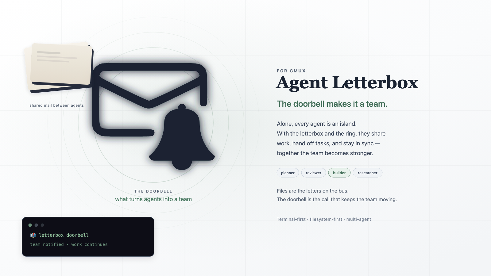

# Agent Letterbox for cmux

## Ring the bell. Create the team.



**Agent Letterbox for cmux turns separate coding-agent terminals into a live team.**

## What it is

Agent Letterbox is not a model, a new terminal, or a second agent harness. It is the coordination layer that lets the agents you already run hand work to one another without making you the human message relay.

A task lands as a durable letter in a teammate's inbox. The doorbell rings, alerting the agent to check it:

```text
📬 letterbox doorbell: check your inbox
```

The agent wakes, picks up the real task from disk, replies, and keeps the work flowing. The terminal gets the knock; the inbox keeps the message.

> **Agent mail that waits safely—and a bell brings it alive.**

## Why it exists

Without coordination, a multi-agent workflow usually means juggling panes, copying task text, remembering who owns what, and hoping an offline agent eventually sees a message.

Directly injecting the full task into another terminal is fast, but the terminal becomes the only message record. Agent Letterbox keeps the fast part—the live doorbell—while putting the actual work in a durable, inspectable letter.

```text
full task    → durable inbox letter
live wake-up → short generic doorbell
reply        → sender inbox
archive      → recipient processed history
```

Read the full comparison in [Why Letterbox?](docs/why-letterbox.md).

## v0.2 lifecycle in one screen

Public v0.2 is a **correctness** release: acknowledgements no longer file work away.

```text
send task (requires_ack=true)
  → recipient: reply ack     # accepted WIP; letter stays in inbox (.md.ack)
  → recipient: does the work
  → recipient: reply result  # terminal; letter moves to processed/
```

Non-task letters (`info` / `status` / received replies) are filed with no invented response:

```bash
letterbox file <id>
```

See [SPEC.md](SPEC.md) and [docs/lifecycle.md](docs/lifecycle.md).

## What this opens up

- **Near-instant coordination** — a live agent can receive a doorbell and begin its next turn without human copy/paste.
- **Real handoffs** — implementation, review, research, QA, and fixes can move between agents as explicit owned work.
- **A visible team** — agents can live in separate cmux panels, workspaces, or windows and still coordinate across them.
- **Durable recovery** — if an agent is offline, restarting, busy, or misses the bell, the task remains in its inbox.
- **Clear responsibility** — task letters require ACK/NACK/RESULT; ACK means in progress, not done.
- **Evidence over claims** — inbox, reply, sidecar, and processed files show what happened even when an agent conversation is gone.
- **Less human relay work** — you direct the team instead of pasting the same request between terminals.

This repository is purpose-built for live cmux agent teams.

---

# Quick start: set up your cmux team

You need macOS or Linux, Bash, Git, and cmux. No server, database, cloud account, or custom cmux layout is required.

## Step 1 — Install Agent Letterbox

Open any terminal window. You can either copy/paste the commands yourself, **or ask an existing coding agent**:

> Set up Agent Letterbox for cmux using the README Quick Start. Do not change my cmux layout.

### Option A — Recommended: copy/paste installer

```bash
curl -fsSL https://raw.githubusercontent.com/SimonMallas/agent-letterbox-cmux/main/install.sh | sh
export PATH="$HOME/.local/bin:$PATH"
letterbox cmux setup --agents planner,reviewer,builder,researcher --automatic-doorbells
source "$HOME/.agent-letterbox/env.sh"
```

This downloads a local copy and sets up the team. If you are new to GitHub, you do not need to understand Git first—copying the block is enough.

To update later, run the same installer again:

```bash
curl -fsSL https://raw.githubusercontent.com/SimonMallas/agent-letterbox-cmux/main/install.sh | sh
```

### Option B — Manual Git install

Use this if you want to inspect the source, modify it, or contribute:

```bash
git clone https://github.com/SimonMallas/agent-letterbox-cmux.git \
  ~/src/agent-letterbox-cmux
cd ~/src/agent-letterbox-cmux
chmod +x bin/letterbox adapters/*.sh tests/*.sh
export PATH="$PWD/bin:$PATH"
letterbox cmux setup --agents planner,reviewer,builder,researcher --automatic-doorbells
source "$HOME/.agent-letterbox/env.sh"
```

Both options automatically create one shared Letterbox, agent inboxes, the global `letterbox` launcher, the shared Agent Letterbox skill, and the live-surface registration registry.

> `--automatic-doorbells` lets Letterbox type the generic doorbell into a live agent terminal. Use it only for dedicated agent terminals: like any terminal-input tool, it can submit text already typed in a target terminal.

## Step 2 — Open cmux your way

Open cmux and arrange agents however the task requires:

```text
one workspace per agent
four-panel grid
separate windows
any mix that suits the task
```

Agent Letterbox does not create, move, or resize your panels.

## Step 3 — Launch agents through Letterbox

In each agent's chosen cmux pane, use the launcher:

```bash
letterbox cmux run planner -- <your-agent-cli>
letterbox cmux run reviewer -- <your-agent-cli>
letterbox cmux run builder -- <your-agent-cli>
letterbox cmux run researcher -- <your-agent-cli>
```

The launcher gives the agent an identity, registers its current cmux surface, and starts it. That is what lets Letterbox find and ring agents across workspaces.

## Step 4 — Send the first handoff (ack, then result)

From the planner terminal:

```bash
printf '%s\n' 'Review src/auth.ts and report correctness findings.' |
  LETTERBOX_AGENT=planner letterbox send reviewer delegate auth-review --ack --now
```

Prefer `printf … | letterbox …` for bodies. Avoid unquoted heredocs when the text may contain `$` or backticks — the shell expands those before Letterbox sees them. The CLI owns frontmatter; only the body goes on stdin.

The reviewer receives a durable letter and a live cmux doorbell. Accept the work (non-terminal):

```bash
printf '%s\n' 'ACK: reviewing auth.ts now.' |
  LETTERBOX_AGENT=reviewer letterbox reply <message-id-or-inbox-path> ack auth-review --now
```

The letter stays in the reviewer's inbox with an `.md.ack` sidecar (`letterbox check` shows `[ACCEPTED]`). When finished, close it:

```bash
printf '%s\n' 'RESULT: no critical issues; two nits in findings.md.' |
  LETTERBOX_AGENT=reviewer letterbox reply <message-id-or-inbox-path> result auth-review --now
```

Only `nack` or final `result` moves the original letter to `processed/`.

## New or duplicate agents

Give each new or duplicate session a unique identity:

```bash
letterbox cmux run planner-research -- <your-agent-cli>
letterbox cmux run builder-a -- <your-agent-cli>
letterbox cmux run agent-zero -- <your-agent-cli>
```

Each self-registers its exact current cmux surface, avoiding title collisions.

## Upgrading from an early checkout

If you cloned this repository before v0.2.0, one behaviour has changed and it matters: **acknowledging a letter no longer files it away.** `letterbox reply <id> ack` now marks the letter as accepted work in progress and leaves it in the inbox; only `nack` and `result` close it. Previously an acknowledgement archived the letter, so accepted work disappeared from the inbox that was tracking it.

There is no data migration. The message format is unchanged and your existing letters remain valid. Pull, and carry on.

Two notes: your inbox may show more letters than before — those are letters an acknowledgement wrongly archived, and seeing them again is the fix working. And all agents in a team should run the same version. If you intentionally downgrade to v0.1, delete leftover `.md.ack` sidecars first.

## Test the installation

```bash
letterbox --version
make test
```

## Learn more

- [docs/lifecycle.md](docs/lifecycle.md) — task vs non-task, ACK/NACK/RESULT, `file`
- [docs/why-letterbox.md](docs/why-letterbox.md) — why durable letters plus generic doorbells beat direct task injection
- [docs/team-setup.md](docs/team-setup.md) — detailed cmux team setup
- [docs/cmux.md](docs/cmux.md) — cross-workspace operation, recovery after updates
- [SPEC.md](SPEC.md) — normative protocol (v0.2)
- [SECURITY.md](SECURITY.md) — threat model and reporting
- [ROADMAP.md](ROADMAP.md) — scope and deferred items
- [CHANGELOG.md](CHANGELOG.md) — user-visible changes

## License

[MIT](LICENSE)
